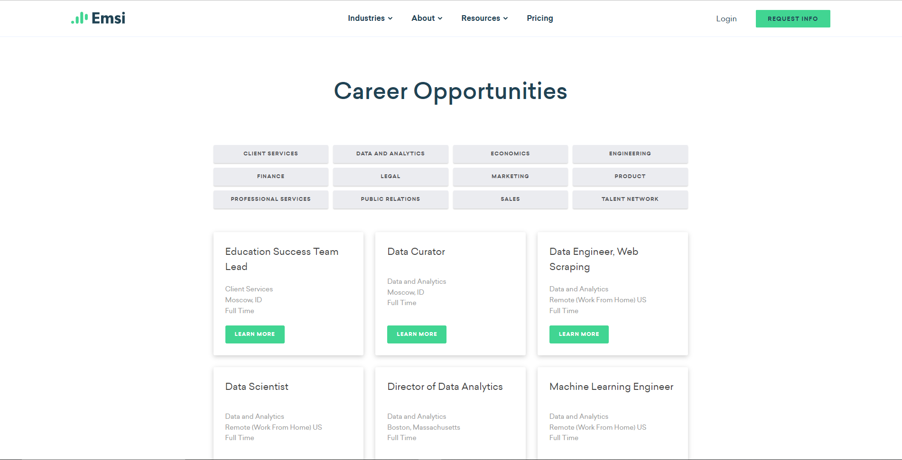

# Scrape [Emsi BG's open job positions](https://www.economicmodeling.com/open-positions/) 👀



Using scrapy, we scrape open position data from the Emsi Burning Glass website. 

Emsi is a labor market data company with headquarters in Boston and Moscow, Idaho, along with offices in the UK, Europe, India, and other global locations. They serve clients across the US, the UK, Canada, the European Union, and the Asia-Pacific region, helping them clients solve a variety of problems.

The job postings on their site are grouped by different teams that they belong to. For each group there are multiple different job postings.

The code crawls the site and extracts all of the job postings for the different teams. From there it extracts the details for each posting, which are detailed below.

This data can be used to extract various insights. For example, one could sort the jobs by the date posted, and find the jobs that have been open the longest. It would be reasonable to suppose that apply for those jobs would have a higher than average acceptance rage, presuming you meet the qualifications.

The data can also be used to monitor the pace at which different teams are opening new positions. One could examine the change in the number of positions posted on a particular team over time to see if the pace is quickening.
---
### ✔️ Fields Scraped & Example Row
|Job Title                              |Job Description                                                                |Location                  |Department        |Commitment         |Team                 |Team Openings|Date Posted        |URL                                                                        |ID                                  |
|---------------------------------------|---|--------------------------|------------------|-------------------|---------------------|-------------|-------------------|---------------------------------------------------------------------------|------------------------------------|
|Education Success Team Lead            |We are seeking a collaborative, detail-oriented... |Moscow, ID                |Education         |Full Time          |Client Services      |1            |2022-01-05 09:38:43|https://jobs.lever.co/economicmodeling/390d26a0-e45c-4f6d-9bfd-ad7c50da188c|390d26a0-e45c-4f6d-9bfd-ad7c50da188c|

---
### The full harvested data is available to view and download in multiple different formats.
* [data.csv](assets/data.csv)
* [data.json](assets/data.json)
* [data.xml](assets/data.xml)

---

## 💡 To run the scraper locally 
- Clone the repository
- Follow the [scrapy installation guide](https://docs.scrapy.org/en/latest/intro/install.html)

- Then run 
    ```py 
    scrapy crawl careers -O <output_file>
    ```
- See the [docs](https://github.com/VolVox99/EmsiBG-Career-Scraper) for more details